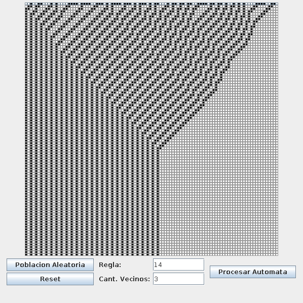
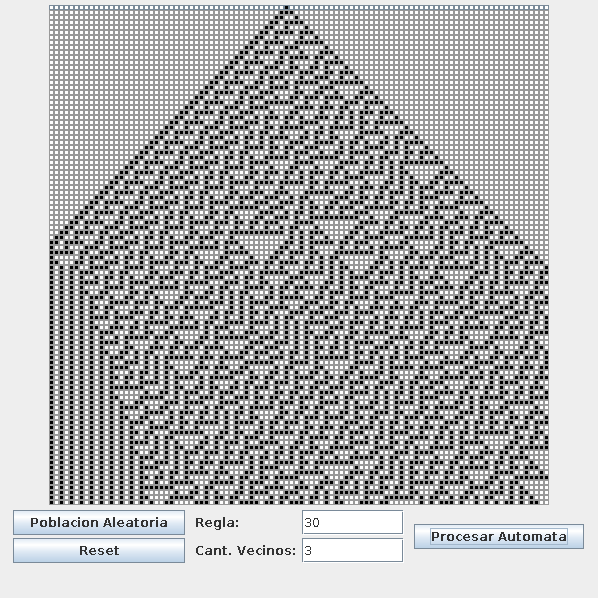
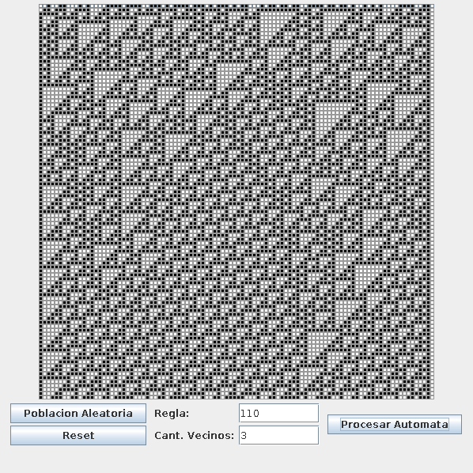

# Manchitas
[Main Repository](https://gitlab.com/larvasapiens/Manchitas)

One-dimensional Cellular Automata visualizer made in pure Java (JDK v1.7).







## Requisites
* Java JDK v1.7 or higher (Tested on 1.7 and 1.8).

## Usage

### Compile it:
```
>> mkdir classes # Create a folder called `classes` so the compilation
	# files don't get mixed with the source code.

>> cd src # Locate at the src folder.

>> javac -d ../classes/ CA/*.java # Compile the source code and send the
	# output files to the classes folder.
```
        
### Run it:
  ```
    cd ../classes
    java CA/FramePrincipal
  ```
### Use it:
* Configure the initial population by clicking the cells of the first row. The
  coloured cells are `alive`, while the blank cells are `dead`.
  
    * You can also get a random initialization by clicking the `Poblacion Aleatoria` button.
    * Push the `Reset` button to return all the cells from the first row to a `dead` state 

* Write the rule that you want to visualize in the `Regla` field. Be sure to write
  a valid rule (ranging from 0 to 2^(2^(<number of neighbors>))).
    * You can change the number of neighbors that each cell will have into account
    when deciding its next state by writing it in the `Num. de Vecinos` field.
    (3 by default).
          
* Push the `Procesar Automata` button to visualize the Automata. Each column represents
  a cell, changing over time. Each row is a specific time steps. Manchitas supports
  100 cells and 100 time steps. A `Cold Frointer` is assumed.

## Troubleshooting
* Be sure that you are running the commands from the folders shown at the Usage
  section. Java uses the folder structure to determine the packages.

